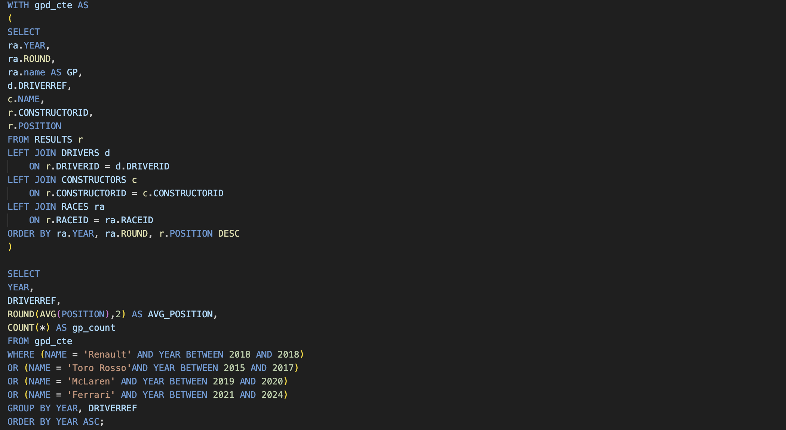
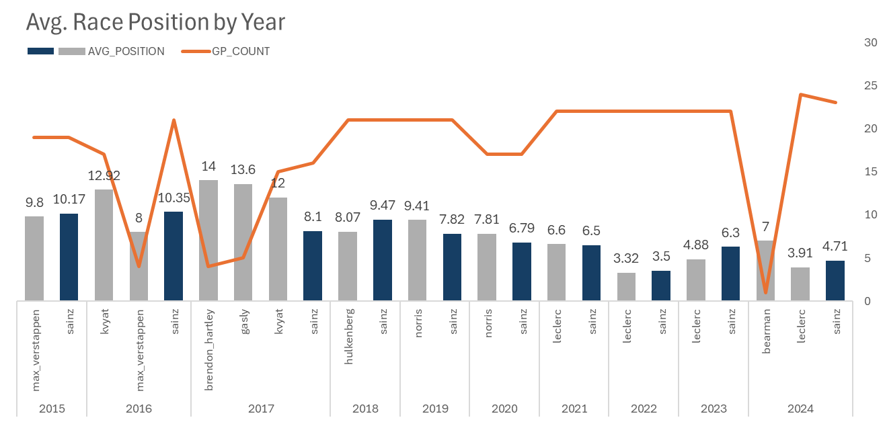
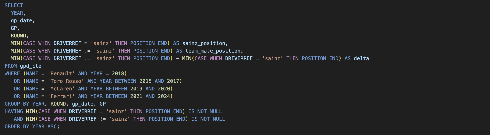
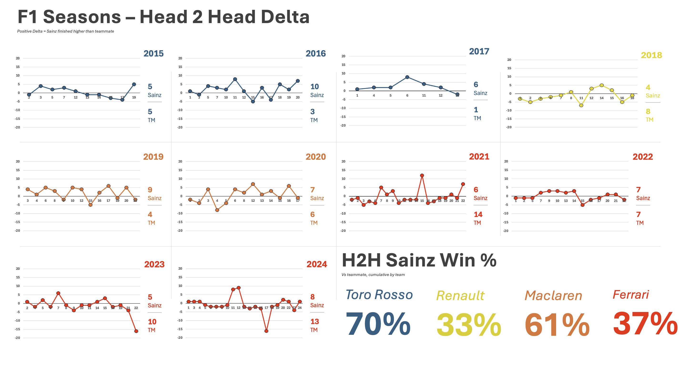

# PROJECTS
### Prologue
I decided to host a web page of little projects, based on questions that I wanted to answer. In doing so, I hope to offer employees a window into my work, thought processes and satisfy my curiosities. 

# PROJECT 1
## How good an F1 driver is Carlos Sainz?

### Introduction
After the death of my hero Ayrton Senna at Imola in 1994, which I watched live, I started to fall out of love with Formula 1. I then stopped watching when Michael Schumacker kept winning every race and championship - it had become very boring. But something changed in the early 2000's, a young Spanish lad called Fernando Alonso started to make waves. I started watching again and have not stopped. It's well known how good Fernando Alonso is and now at the age of 44 after having won 2 F1 Championships he is still driving and performing well. 

There was a new Spanish driver who entered F1 in 2015, Carlos Sainz, son of the famous rally driver of the same name. Having paid close attention to his career, I have often felt that he has been undervalued and in early 2025, Ferrari chose to replace Carlos Sainz with Lewis Hamilton. Now, its hard to argue when the person who is to replace you is a 7 time F1 champion, but I would have thought Carlos Sainz would have been snapped up by one of the top three teams. He wasn't and in 2024 he signed to Williams. 

I still can't help to thinking that the top teams are missing out on this...in his own words...'smooth operator'. I wanted to have a look at the F1 Data and at how Sainz's race results compare with his team mates, by year. Comparing to his teammates gives us a more accurate comparison because they are in the same car, albeit sometimes with slightly different set ups. My hypothesis is that on average he will have had better results than he's teammates. Let's find out.

### Kaggle
I downloaded the F1 data set from kaggle.com, a community that offers a lot of data sets, runs competitions and keeps its community up to date with the latest news on Machine Learning and Data Science.

### Oracle Cloud
I signed up for a free Oracle Cloud account and created an autonomous database so that I could store my data files as objects within buckets.

### SQL
I imported the Oracle SQL plugin on my VS Code IDE and continued to download the data from my Oracle Cloud database, as per below example:

I then continued to create the tables that I needed so that I could begin to query the data. I checked to see when Sainz started his career and what years he was at what teams. I did initially create a view that encompassed the basic information that I needed to then query that view. However, in order to showcase the use of cte's I created one query with a cte that pulls in all the information needed.

Pulling the avg. race results by year, driver and team only for the teams that Carlos Sainz was part of, I started to develop a picture of where he stood in comparison to his teammates. Realising that the race count would be important, I decided to add that also as there are certain drivers who had only driven two races in the year. The sample size is not significant but I have kept them in the data to show a real picture of who were his teammates.

### Graph 1
After pulling the data from SQL, I built a graph and made it as clear as possible to the viewer. Choosing a bar chart helps visually to compare Sainz (in blue for easy comparison) vs. his team mates, making it easy to spot who outperformed who, in a given season. Adding a line for the GP_count provides context for the drivers who only drove partial seasons, helping to avoid false conclusions from small samples, but providing an accurate depiction of what took place.

### Insights

2015 (Toro Rosso) Slightly outperformed by Max, both did full seasons (19 GPs)  
2016 (Toro Rosso) Sainz comfortably outperformed Kvyat, but Verstappen was faster in limited races  
2017 (Toro Rosso) Dominated his teammates statistically  
2018 (Renault) Outperformed by Hulkenberg  
2019 (McLaren) Beat Norris fairly clearly  
2020 (McLaren) Slight edge to Sainz again  
2021 (Ferrari) Essentially tied, slight edge to Sainz  
2022 (Ferrari) Slightly outperformed by Leclerc  
2023 (Ferrari) Leclerc ahead more clearly  
2024 (Ferrari) Leclerc ahead again, though not by a huge margin  

### SQL - Delta
Seeing the average race result by season vs. his teammate was good but I really wanted a picture of how each driver performs vs each other by GP round. A head2head visual that shows when both drivers finished the race, who came out on top and by how much. I wanted to also see the count for the season i.e. how many times in the season did Sainz come out on top and vice versa. Then I can summarise the % of times that Sainz finished higher than his teammate by team. Therefore, I amended my SQL query that references the cte to be able to do this as per below: 

### Graph - Delta
I created the below graphs to show the delta, the difference between Sainz race results and his teammates. A positive number, meaning Sainz finished higher than his teammates and a negative number meaning he finished lower than his teammates. The greater the difference from 0, the greater the difference from where both teammates finished. I only wanted to show races where both drives finished the race, hence there are some numbers missing from the GP Rounds. I choose to keep the Y axis bounds consistent through all the graphs for ease of comparison and also highlighted the totals for that year on the right of the chart. 

### Insights - Delta
2015 - 2017 (Toro Rosso) What's interesting to note here is that when we looked at his average race result previously max had outperformed Sainz in 2015. However, what the H2H data tells us is that, when we look at the GP rounds that both drivers managed to finish, they had both finished higher than each other a total of five times. And when we look at his overall career at Toro Rosso we see Sainz finishing higher that his teammates a whopping 70% of the time.  
2018 (Renault) Hulkenburg outperforms Sainz  
2019 - 2020 (Mclaren) Sainz over his two years at Mclaren finishes higher than Lando Norris 61% of the time and often by quite a margin or around 5 positions especially in his first season.  
2021 - 2024 (Ferrari) Apart from 2022 where Sainz and Leclrec beat each other equally, Leclerc finishes higher in the other three years. Although looking at the delta not by much. However, I noticed that when Sainz did beat Leclerc he beat him by a greater margin which prompted me to just check the driver standings for each year. What I found was Sainz finished higher than Lecrec in the driver standings for 2021 but not in any other year at Ferrari. Sainz only managed to beat Lelcerc in 31% of the H2H. 

### Summary
There are other questions that come to mind and other interesting things that I want to explore for example the qualifying data but given this is supposed to be a handful of small projects we must draw the line. 
Looking at the data I have compiled as a whole we see a very good driver performing very well apart from 2018 in his one season at Renault and perhaps the last two seasons at Ferrari. However, he is consistent and even in the seasons he does not perform well the delta to his teammate is not significantly large as highlighted in 2021, where he still finished higher than Leclrec in the driver standings. It's interesting to note when he was at Mclaren he performed better than his teammate Norris and Norris is currently fighting for the Championship, as he was last year. It does make me wonder - what if Sainz didn't leave Mclaren. We can only speculate but looking at his past performance, I would say he would be on to win his first F1 Championship. 

### Conclusion/Summary
Based on the above analysis of Carlos Sainz's race results, we see a driver who consistently delivers strong results accross multiple teams over the years.

### Key Findings 
**Consistent Front-Runner:** Carlos Sainz has been a very good driver throughout his career, often matching or outperforming his teammates.  

**Strong McLaren Performance:** He had his most dominant period at McLaren, where he finished ahead of Lando Norris in 61% of their head-to-head races over two seasons. This performance, in hindsight, is a testament to his skill and adaptability.  

**Highly Competitive at Ferrari:** While Charles Leclerc held a slight edge during their time as teammates, the competition was incredibly close. In their first season together, Sainz finished ahead in the driver standings, and in subsequent years, the race delta was never overwhelmingly large.  

**Undervalued Talent:** The data suggests that Sainz is an excellent and consistent performer. The fact that he was not immediately picked up by another top team for 2025 is surprising given his track record, especially in comparison to his former teammate Lando Norris's current success.

In summary, the hypothesis that Carlos Sainz has, on average, had better results than his teammates holds up well across the majority of his career. He is a "smooth operator" not just in his driving style but also in his ability to extract performance from the car and deliver solid, reliable results. 

