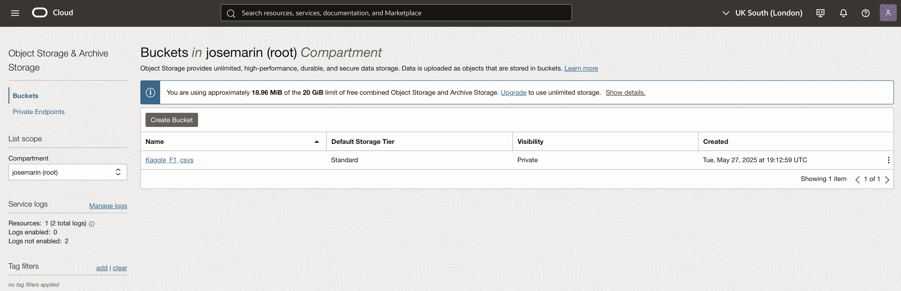
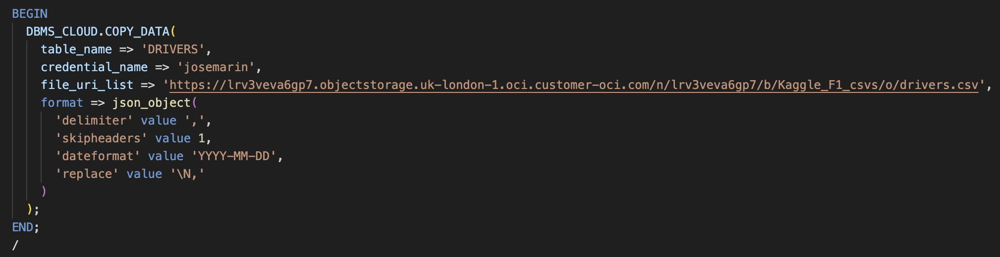
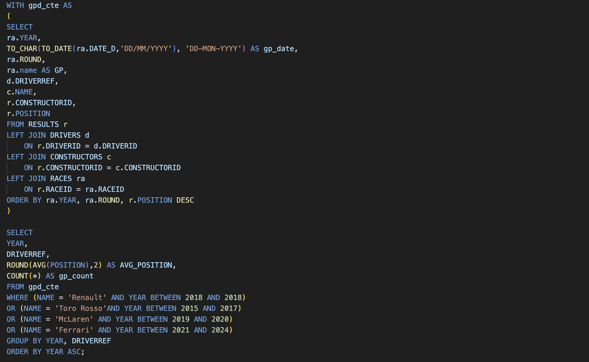

# PROJECTS
### Prologue
I came to the realisation after a few months of not getting a job that I should try and showcase some work. How can a company really see what you will be able to offer without this. Therefore, I set out to host a projects pages showcasing small little projects based on questions that I wanted to answer. In doing so I hope to offer employees a window into my work and thought processes. I have chosen a narrative format in order that I can inject some of my personality into the work itself and so offering an understanding myself, the person.  

# F1
## How good a F1 driver is Carlos Sainz?

### Prologue
After the death of my hero Aytron Senna at Imola in 1994, which I watched live, I started to fall out of love with Formula 1 and stopped watching when Michael Schumacker kept winning every race and championship. something chnged in the early 2000's a young Spanish man called Fernando Alonso started to makes waves. I started watching again and have not stopped. It's well known how good Fernando Alonso is and now at the age of 44 after having won 2 F1 Championships he is still driving and performing well. 

There was a new Spanish driver who entered F1 in 2015, Carlos Sainz son of the famous rally driver of the same name, must be in the genes. Having paid close attention to his carreer i have often felt that he has been undervalued and my suspicions were validated when in early 2025 Ferrari chose to replace Carlos Sainz with Lewis Hamilton. Now its hard to argue when the person who is to replace you is a 7 time f1 driver champion but i would have thought Carlos Sainz would have been snapped up by one of the top three teams, but he wasnt at in 2024 he signed to Williams. 

I still cant help to this that the top teams are missing out on this, in hiw own words, 'smooth operator'. I wanted to have a look at the F1 Data and at how Sainz's race results compare with his team colleague for that year. My hypothesis is that on average he will have had better results that hes team mate.  

### Kaggle
I downloaded the F1 data set from kaggle.com a community that offers a lot of data sets and runs competitions as well as keeps its community up to date with the latest news on Machine Learning and Data Science.

### Oracle Cloud
I signed up for a free account Oracle Cloud account and created an autonumous database so that i could store my data files as objects within buckets.

### SQL
I imported the Oracle SQL plug in on my VSCode application and continued download the data from my Oracle Cloud database as per below example:

I then continued to create the tables that i needed so that i could begin to take a look at the infiormation that i needed. I first queried the data to check when Sainz started his career and what years he was at what teams. I did intially create a view that encompassed basic information that i needed to then query that view from. However in order to showcase the fact that i know how to work with cte's i created one query with a cte thatr pulls in all the information i needed.
The main thing i was looking for was to pull information of the years Sainz was driving, at what team and who was his team mate and show the avg race result by year. I thought it was important to also highlight the race count also because some of the people showing had only raced a few races in that particular year and therefore there results were not stratistically significant. I could have omitted them but have decided to keep them in as they were part of the team if albeit for a few races in that year. 

